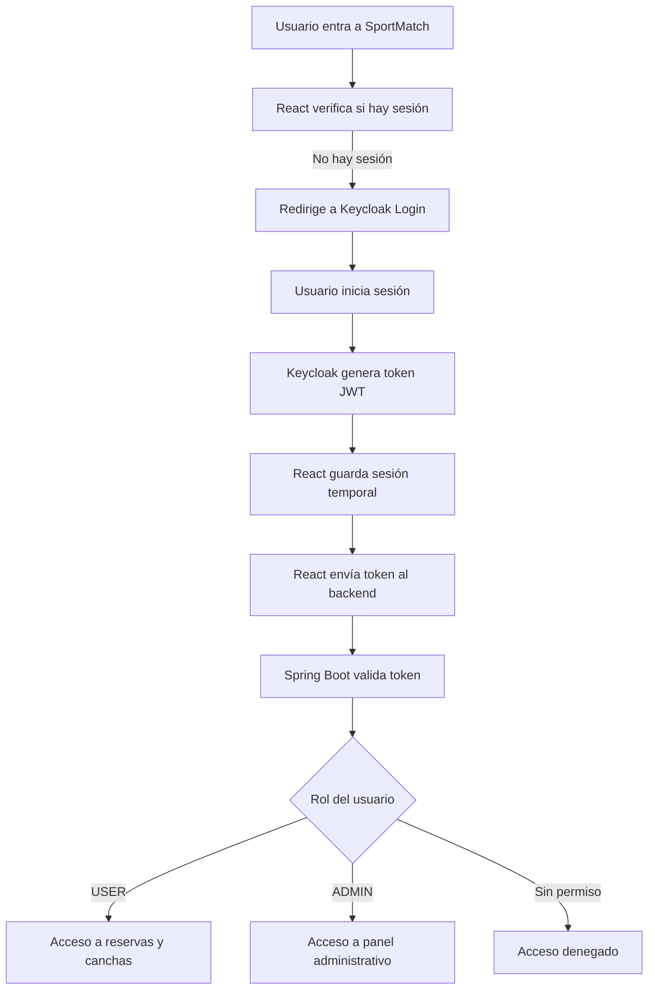

# Historias de Usuario

## Descripción general

Durante el proceso de contribución al proyecto se identificaron historias de usuario
a partir del análisis del sistema existente y las necesidades detectadas en él.

Cada historia de usuario representa una funcionalidad nueva o una corrección de error
que el equipo decidió aportar al proyecto, relacionándola con un issue en el tablero
de Codeberg y trabajándola mediante una rama independiente siguiendo el flujo de
GitFlow definido por el equipo.

Debido a que el proyecto cuenta con múltiples contribuciones registradas, en esta
sección se presenta una tabla resumen con las historias más relevantes y
posteriormente se detalla el proceso seguido para cada una de ellas.

---

## Tabla resumen de historias de usuario

| Código    | Historia de usuario                               | Prioridad | Estado     |
|-----------|---------------------------------------------------|-----------|------------|
| HU-01     | Revisar estado actual                             | Alta      | Finalizada |
| HU-02     | Definir Autenticacion                             | Alta      | Finalizada |
| HU-03     | Definir integracion de mapas                      | Alta      | Finalizada |
| HU-04     | Configurar Entorno Docker                         | Baja      | Finalizada |
| HU-05     | Configurar Keycloak                               | Media     | Finalizada |
| HU-06     | Integrar backend con keycloak                     | Media     | Finalizada |
| HU-07     | Integrar frontend con keycloak                    | Media     | Finalizada |
| HU-08     | Proteger Rutas                                    | Alta      | Finalizada |
| HU-09     | Mostrar mapa de canchas                           | Alta      | Finalizada |
| HU-10     | Guardar coordenadas                               | Media     | Finalizada |
| HU-11     | Filtrar canchas                                   | Baja      | Finalizada |
| HU-12     | Mejorar interfaz                                  | Media     | Finalizada |
| HU-13     | Validar reservas concurrentes                     | Baja      | Finalizada |
| HU-14     | Probar autenticacion                              | Alta      | Finalizada |
| HU-15     | Probar mapas y filtros                            | Alta      | Finalizada |
| HU-16     | Integrar modulos finales                          | Alta      | Finalizada |
| HU-17     | Desplegar con Docker                              | Media     | Finalizada |
| HU-18     | Validar despliegue                                | Media     | Finalizada |
| HU-19     | Documentar arquitectura                           | Baja      | Finalizada |
| HU-20     | Documentar integraciones                          | Baja      | Finalizada |
| HU-21     | Preparar presentacion final                       | Alta      | Finalizada |
| HU-22     | Sistema de reseñas                                | Media     | Finalizada |
| HU-23     | Implementar flujo de cancelacion de reservas      | Baja      | Finalizada |
| HU-24     | Panel de estadisticas                             | Baja      | Finalizada |
| HU-25     | Perfil de usuario                                 | Media     | Finalizada |
| HU-26     | Implementar paginacion de canchas                 | Baja      | Finalizada |
| HU-27     | Sistema de notificacion de reservas               | Baja      | Finalizada |
| HU-28     | Prueba funcionamiento keycloak                    | Baja      | Finalizada |
| HU-29     | Realizar guia instalacion keycloak                | Baja      | Finalizada |

[Tablero](https://codeberg.org/avalosjorge09/Proyecto-Ingenieria-de-Software/projects/52499)

---

## Autenticacion y Autorizacion

| Rol           | Permisos Principales                                                      |
|---------------|---------------------------------------------------------------------------|
| User          | Ver canchas, hacer reservas, cancelar reservas propias, ver historial.    |
| Admin         | Gestionar canchas, ver todas las reservas.                                |

### Flujo de autenticación

