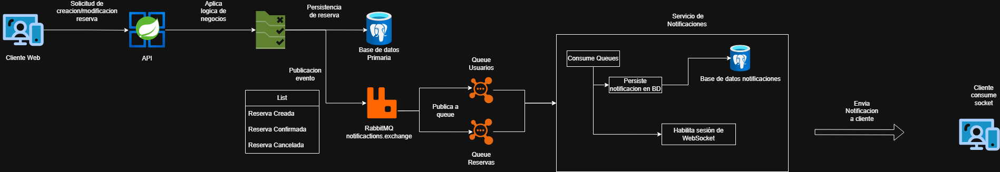

# Integraciones Externas

## Descripción general

Durante el desarrollo de las contribuciones al proyecto SportMatch se integraron
tres herramientas de código abierto para reemplazar o complementar funcionalidades
existentes. Cada integración fue seleccionada considerando su licencia, su
compatibilidad con el stack tecnológico del proyecto y su impacto sobre los cambios
realizados por el equipo.

---

## Keycloak

Keycloak es una solución de código abierto para la gestión de identidad y acceso
(IAM). Se integró en el proyecto como proveedor de autenticación, ofreciendo una
alternativa al sistema de login existente sin modificar la lógica de negocio del
resto del sistema.

### Rol en el proyecto

Se utilizó para gestionar el inicio de sesión de los usuarios mediante un flujo
estándar de autenticación basado en tokens JWT. Keycloak actúa como servidor de
autorización, emitiendo tokens que el backend de Spring Boot valida en cada
solicitud protegida.

### Licencia

Keycloak se distribuye bajo la licencia **Apache License 2.0**, la cual permite
su uso, modificación y distribución tanto en proyectos de código abierto como en
entornos privados, sin restricciones de uso comercial.

### Consideraciones

- Requiere un servidor propio o contenedor Docker para ejecutarse.
- La configuración se realiza a través de su consola de administración o mediante
  archivos de exportación de realm.
- No interfiere con las contribuciones realizadas al proyecto, ya que actúa como
  capa externa de autenticación. Los cambios en funcionalidades como reservas,
  canchas o notificaciones operan de forma independiente al proveedor de identidad.

---

## RabbitMQ

RabbitMQ es un broker de mensajería de código abierto que implementa el protocolo
AMQP. Se integró en el proyecto para gestionar el sistema de notificaciones en
tiempo real, como alternativa al envío de correos electrónicos.

### Rol en el proyecto

Cada vez que un usuario realiza o cancela una reserva, el backend publica un evento
en una cola de RabbitMQ. Al iniciar sesión, el usuario se suscribe a un WebSocket
con STOMP que escucha esa cola y entrega las notificaciones pendientes en tiempo real.

### Diagrama de implementación

### Licencia

RabbitMQ se distribuye bajo la licencia **Mozilla Public License 2.0 (MPL-2.0)**,
la cual permite su uso en proyectos de cualquier tipo. Las modificaciones al código
fuente de RabbitMQ deben mantenerse bajo la misma licencia, pero el código propio
del proyecto que lo consume no está sujeto a esta restricción.

### Consideraciones

- Se ejecuta como contenedor Docker dentro del entorno de desarrollo del proyecto.
- La comunicación entre el backend y RabbitMQ se realiza a través de Spring AMQP.
- La suscripción del cliente se maneja mediante WebSocket con STOMP desde el
  frontend en React.
- No interfiere con las demás contribuciones realizadas al proyecto. El sistema de
  notificaciones opera como un módulo independiente que reacciona a eventos ya
  existentes en la lógica de reservas, sin modificar su funcionamiento.

---

## Leaflet

Leaflet es una biblioteca de JavaScript de código abierto para la visualización de
mapas interactivos. Se integró en el proyecto como reemplazo de Google Maps,
permitiendo mostrar y registrar la ubicación física de las canchas deportivas sin
depender de servicios de terceros con restricciones de uso.

### Rol en el proyecto

Se utilizó para que los administradores puedan registrar la ubicación geográfica
de cada cancha y para que los usuarios puedan visualizarla en un mapa interactivo
al momento de hacer una reserva, facilitando la identificación del lugar físico
donde se encuentra la cancha.

### Licencia

Leaflet se distribuye bajo la licencia **BSD 2-Clause**, una de las licencias más
permisivas del ecosistema de código abierto. Permite su uso, modificación y
distribución sin restricciones, únicamente requiriendo mantener el aviso de
copyright original.

### Consideraciones

- Utiliza **OpenStreetMap** como proveedor de tiles por defecto, el cual se
  distribuye bajo la licencia **ODbL (Open Database License)**, compatible con
  proyectos de código abierto.
- No requiere API key ni registro en ningún servicio externo, a diferencia de
  Google Maps.
- No interfiere con las contribuciones realizadas al proyecto. Su integración se
  limita a los componentes de visualización y registro de ubicación, sin afectar
  la lógica de reservas, autenticación o notificaciones trabajadas por el equipo.

---

## Resumen de licencias

| Herramienta | Licencia              | Uso comercial | Modificación | Distribución |
|-------------|-----------------------|:---:|:---:|:---:|
| Keycloak    | Apache License 2.0    | ✅  | ✅  | ✅  |
| RabbitMQ    | Mozilla Public License 2.0 | ✅ | ✅ | ✅ |
| Leaflet     | BSD 2-Clause          | ✅  | ✅  | ✅  |