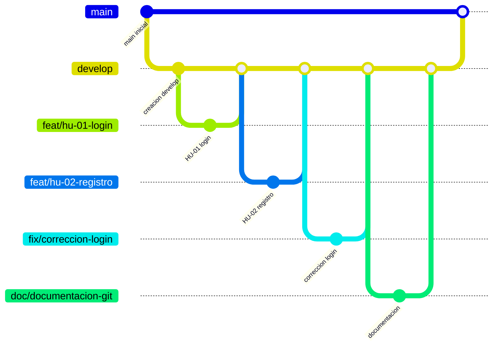

# Uso de Git y GitFlow

## Descripción general

Durante el desarrollo del proyecto se utilizó **Git** como sistema de control de versiones y **GitFlow** como estrategia de organización del trabajo.

Este flujo permitió mantener una estructura ordenada para el desarrollo, separando la rama estable del proyecto, la rama de desarrollo y las ramas específicas utilizadas para cada historia de usuario, corrección o documentación.

El objetivo principal fue evitar realizar cambios directamente sobre la rama principal y mantener una relación clara entre los issues, las historias de usuario y las ramas trabajadas por el equipo.

---

## Flujo de ramas utilizado

El flujo de trabajo inició desde la rama principal `main`, la cual representa la versión estable del proyecto.

A partir de `main` se creó la rama `develop`, utilizada como rama base para integrar los cambios en desarrollo.

Desde `develop` se crearon las ramas correspondientes a cada issue o historia de usuario. Al finalizar el trabajo en cada rama, los cambios se integraban nuevamente en `develop`.

Finalmente, cuando los cambios ya estaban revisados y validados, se integraban desde `develop` hacia `main`.

---

## Representación del flujo de trabajo



---

## Convención de nombres de ramas

Para mantener una estructura uniforme, se definió una nomenclatura específica para las ramas del proyecto.

| Tipo de rama      | Nomenclatura                  | Uso                                                           |
|-------------------|-------------------------------|---------------------------------------------------------------|
| Funcionalidad     | `feat/hu-xx-nombre`           | Desarrollo de historias de usuario o nuevas funcionalidades   |
| Corrección        | `fix/nombre-correccion`       | Solución de errores encontrados durante el desarrollo         |
| Documentación     | `doc/nombre-documentacion`    | Cambios relacionados con documentación del proyecto           |

---

## Ramas para historias de usuario

Para cada historia de usuario se creó una rama independiente desde `develop`.

La nomenclatura utilizada fue:

```bash
feat/hu-xx-nombre
```

Donde:

- `feat` indica que la rama corresponde a una nueva funcionalidad.
- `hu` hace referencia a historia de usuario.
- `xx` representa el número de la historia de usuario.
- `nombre` describe brevemente la funcionalidad trabajada.

Ejemplo:

```bash
feat/hu-01-inicio-sesion
feat/hu-02-registro-usuario
feat/hu-03-gestion-reservas
```

---

## Ramas para correcciones

Cuando se detectaba un error o comportamiento incorrecto en el sistema, se creaba una rama de corrección utilizando el prefijo `fix/`.

La nomenclatura utilizada fue:

```bash
fix/nombre-correccion
```

Ejemplo:

```bash
fix/error-validacion-formulario
fix/correccion-login
fix/correccion-rutas
```

Estas ramas permitieron corregir errores sin afectar directamente la rama `develop` o `main`.

---

## Ramas para documentación

Para los cambios relacionados con documentación se utilizaron ramas con el prefijo `doc/`.

La nomenclatura utilizada fue:

```bash
doc/nombre-documentacion
```

Ejemplo:

```bash
doc/uso-git
doc/documentacion-issues
doc/actualizacion-readme
```

Esto permitió separar los cambios técnicos del código fuente de los cambios relacionados con documentación.

---

## Proceso de trabajo aplicado

El proceso de trabajo seguido por el equipo fue el siguiente:

1. Se mantuvo la rama `main` como rama estable del proyecto.
2. Se creó la rama `develop` a partir de `main`.
3. Cada integrante trabajó sus tareas desde ramas creadas a partir de `develop`.
4. Para cada historia de usuario se creó una rama con la nomenclatura `feat/hu-xx-nombre`.
5. Para correcciones se utilizaron ramas con el prefijo `fix/`.
6. Para documentación se utilizaron ramas con el prefijo `doc/`.
7. Al finalizar una tarea, la rama se integraba nuevamente en `develop`.
8. Cuando los cambios estaban completos y revisados, se integraban desde `develop` hacia `main`.

---

## Ejemplo de comandos utilizados

```bash
# Cambiar a la rama principal
git checkout main

# Crear la rama develop desde main
git checkout -b develop

# Cambiar a develop
git checkout develop

# Crear una rama para una historia de usuario
git checkout -b feat/hu-01-inicio-sesion

# Agregar los cambios realizados
git add .

# Crear un commit
git commit -m "feat: desarrollo de historia de usuario HU-01"

# Subir la rama al repositorio remoto
git push origin feat/hu-01-inicio-sesion

# Regresar a develop
git checkout develop

# Integrar los cambios de la rama trabajada
git merge feat/hu-01-inicio-sesion

# Subir los cambios de develop
git push origin develop
```

---

## Relación entre issues y ramas

Cada rama creada estuvo relacionada con un issue o historia de usuario del tablero de trabajo.

Esto permitió mantener una trazabilidad clara entre la planificación del proyecto y el desarrollo realizado en el repositorio.

Por ejemplo, si en el tablero existía una historia de usuario identificada como `HU-01`, la rama correspondiente se nombraba de la siguiente manera:

```bash
feat/hu-01-inicio-sesion
```

De esta forma, era más fácil identificar qué funcionalidad se estaba desarrollando y a qué tarea pertenecía dentro de la gestión del proyecto.

---

## Beneficios del flujo utilizado

El uso de GitFlow permitió organizar mejor el trabajo del equipo y reducir el riesgo de errores en la rama principal.

Entre los principales beneficios se encuentran:

- Separación entre código estable y código en desarrollo.
- Mejor control de los cambios realizados.
- Organización clara por historias de usuario, correcciones y documentación.
- Mayor trazabilidad entre issues y ramas.
- Facilidad para revisar e integrar cambios.
- Reducción del riesgo de afectar directamente la rama principal.
- Trabajo colaborativo más ordenado.

---

## Conclusión

La aplicación de GitFlow permitió mantener un proceso de desarrollo más estructurado y controlado.

La creación de ramas específicas para historias de usuario, correcciones y documentación facilitó la organización del equipo, la revisión de cambios y la relación entre el tablero de issues y el código fuente del proyecto.

Gracias a este flujo, el proyecto pudo desarrollarse de manera más ordenada, manteniendo una separación clara entre la versión estable, el desarrollo activo y las tareas individuales.
